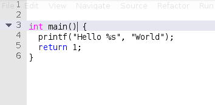
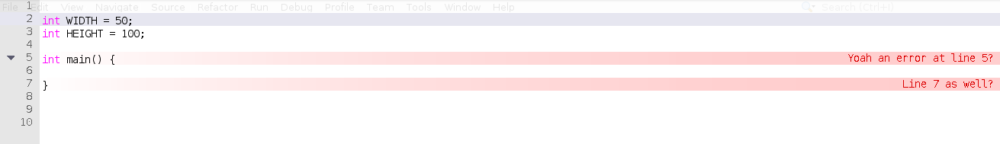
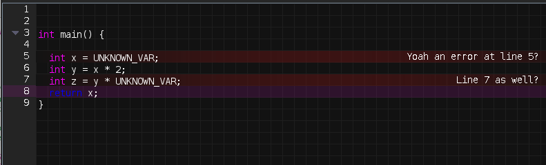

# CodeArea 
- CodeArea is a custom swing code editing component for usage in java applications.
- CodeArea implements much of the standard text editor features such as:
- [X] Syntax Highlighting
- [X] Copy/Paste
- [X] Simple Intellisense 
- [X] Word recommendation (As you type)
- [X] Code folding (Not yet finished but usable)
- [X] DrawLayers (You can draw stuff on the text pane)
- [X] Error lines
- [X] Color Scheme
- [X] Dead simple API
- [ ] Sockets

## Why?
Well, I often find myself exploring the idea of writing code in different enviroments 
(sandboxes) a lot and as a result I find myself writing small intepreters and then try
to integrate them into something big. 

I often fail and burn out before implementing 
editor intergrations, mainly because I suck but partly because the task is hard and 
libraries that exist make it even more hard.
Here are my previous failed attempts at writing a language intergrated enviroment.
- [https://github.com/hexaredecimal/VIDE](https://github.com/hexaredecimal/VIDE)
- [https://github.com/hexaredecimal/luaide](https://github.com/hexaredecimal/luaide)

This project is my attempt at bring a solution that is very simple and fun to setup.
The code is meant to be a simple as possible.

## Showcase

### Video

<video src="./images/show1.mp4" width="50%"></video>

### Images










## Code Example:
More examples are found in the [examples](./examples) directory.

This is a simple example that shows how to use the code editor. 
```java
var editor = new CodeArea();
panel.add(editor); 
```

## Syntax Highlighting
This create a clean editor with no syntax highlighting.
To add syntax highlighting simple do:
```java
editor.addHighlightedWords(
List.of("class", "public", "private", "protected", ...), new Color(0x20c328e3));

editor.addHighlightedWords(
List.of("int", "void", ...), Color.BLUE);
```
This will create 2 sets of highlightable words. 
Each word set will get highlighted with the appropriate color.

### Code folding
To add code folding you have to tell the editor what to fold on.
```java
editor.addFoldSymbolPair("{", "}");
```
The editor will now allow folding on { when it is at the end of the line. 
The opening { will be matched with }. 
This works well for any language e.g:

```java
editor.addFoldSymbolPair("begin", "end");
```

This will fold correctly for pascal and variants. 

### Layers. 
CodeArea uses layers to draw custom "things" to the text pane. 
By the current line is drawn on its layer. Since the editor is 
extremly customizable you can enable, disable, add and remove layers.
Even the ones used by the editor.
See the class `LayerIndex` for layerindexes. 
text is always drawn on top. There are no layers beyond that.

### Hiding and showing layers.
Lets show the default grid layers. Horizontal and Vertical grid lines are drawn on separate
layers.
```java
editor.showLayer(LayerIndex.GRIDX_LAYER);
editor.showLayer(LayerIndex.GRIDY_LAYER);

// use hideLayer to reverse this
```
This is how you add a custom layer. 
```java
editor.addLayer(LayerIndex.BOTTOM_FREE_LAYER++, 
  (int editorWidth, int editorHeight, Graphics2D graphics) -> {
    //... Do your magic. e.g: graphics.drawLine(x1, y1, x2, y2);
  }
);
```

## Error lines.
Other editors user squiggly lines to denote errors. I say squiggly lines are so
retro. Inspired by Qt creatore I took the approach of highlighting the entire line
in a gradient that fades from the code editor background to whatever error color you set.

```java
editor.markErrorAtLine(1, "Simple huh?");
editor.markErrorAtLine(5, "Error!!");
editor.markErrorAtLine(7, "Semicolon missing?");
```
Expected these calls highlight the specified lines and also show the message on the right side.

To remove the errors do:
```java
editor.unmarkErrorAtLine(5);
editor.clearErrorLines(); // Remove all errors
```
## Word recommendation.
As you type the editor is away and recommends you words. The first time a word is 
encountered we cache it and then use it next time a word matches.

## Intellisense.
IntellisenseItem allows the editor to display a dialog about a known symbol. This is useful
for providing documentation while live while coding. To do this use the
 `IntellisenseItem` class like this:

```java
		editor.addCompletion(new IntellisenseItem("add", "Number -> Number -> Number", "Adds 2 numbers"));
		editor.addCompletion(new IntellisenseItem("sumList", "[Number] -> Number", "Sums a list of numbers into a single value"));
```
To trigger the intelisense simple put the cursor on the word and click `ctrl+space`.
You can navigate the intelisence menu while holding ctrl.

## Color Scheme:
The editor has a default light mode color scheme that can be modified. 
Here is a nice dark mode color scheme. This can work well with flatlaf.
```java
Colors.setBackgroundColor(new Color(18, 18, 18));
Colors.setGutterBackgroundColor(new Color(18*2, 18*2, 18*2));
Colors.setGutterForegroundColor(new Color(255 - 18, 255 - 18, 255-18));
Colors.setForegroundColor(Color.WHITE);
Colors.setCurrentLineColor(new Color(140, 25, 130, 60));
Colors.setErrorLeftGradientColor(Colors.getBackgroundColor());
Colors.setErrorRightGradientColor(new Color(160, 20, 20, 30));
Colors.setErrorTextColor(Color.WHITE);
Colors.setGridColor(new Color(30, 30, 30));
```


